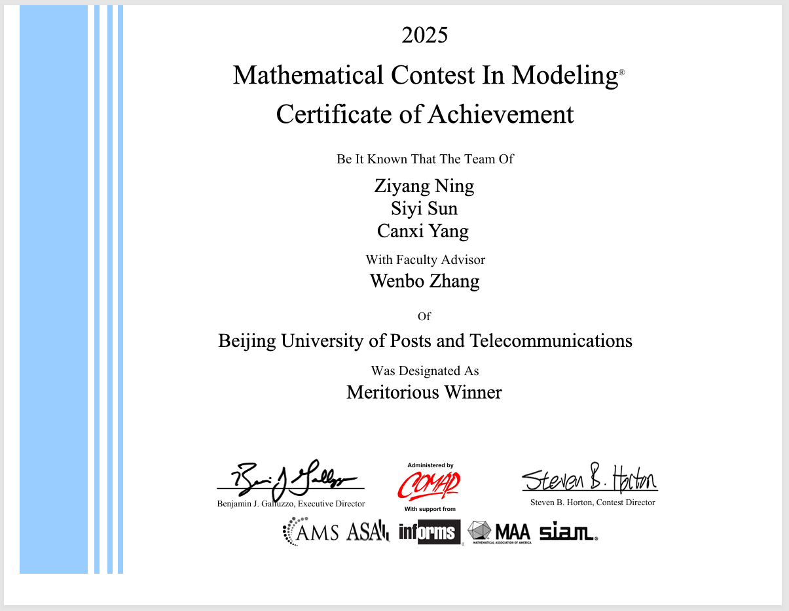

# 2025 MCM Problem B — Meritorious Winner 🏆

This repository contains the code used for our solution to **Problem B** of the **2025 Mathematical Contest in Modeling (MCM)**. [Read the full paper](2519437_FinalReport.pdf)

Our team was awarded **Meritorious Winner** in the **2025 MCM**.

> **Team Control Number:** 2519437  
> **Problem:** MCM Problem B  
> **Award:** Meritorious Winner  
> **Institution:** Beijing University of Posts and Telecommunications | 北京邮电大学

  

## Project

We developed a **TRES (Tourism–Revenue–Environment–Satisfaction) Model** to design sustainable tourism strategies for **Juneau, Alaska**, balancing economic benefits, environmental protection, and resident satisfaction.

The model integrates three interconnected components:

- **Environment:** models carbon emissions and glacier melting under different tourist volumes and environmental investments.
- **Revenue:** analyzes the relationship between tourist numbers, bed-tax rates, and tourism revenue.
- **Resident Satisfaction:** evaluates the effects of infrastructure investment, income, unemployment, and tourism congestion.

We formulated the problem as a **multi-objective optimization problem** using **Goal Programming (GP)** and implemented a **Genetic Algorithm (GA)** to explore different policy priorities, including **Environment-First, Economy-First, and Social-Priority** scenarios.

The project also includes **sensitivity analysis**, tourism-revenue reinvestment strategies, model adaptation to other overtourism destinations such as **Barcelona**, and a **Cold Spot Boost Factor** for promoting less-visited attractions.

### Key Results

- Recommended annual tourist capacity: **980,000–1,100,000**
- Recommended bed-tax rate: **7.5%–8.1%**
- Estimated environmental impact reduction: **25–30%**
- Maintains strong tourism revenue while improving resident satisfaction
- Sensitivity analysis identified **tourist capacity** and **infrastructure investment** as the most influential factors
- Extended the framework to **Barcelona** and introduced a **Cold Spot Boost Factor** to redistribute tourist flows toward less-visited attractions

## Team

| Member | Contribution |
|---|---|
| **Ning Ziyang** | Modeling, optimization, and algorithm implementation |
| **Sun Siyi** | Data processing, sensitivity analysis and modeling |
| **Yang Canxi** | Model adaptation, visualization, and paper preparation |

**Faculty Advisor:** Zhang Wenbo
